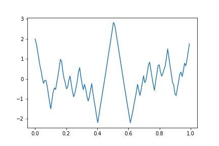
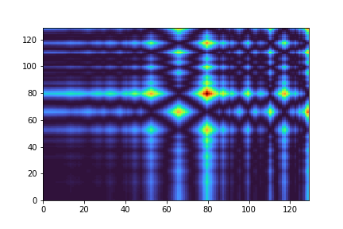
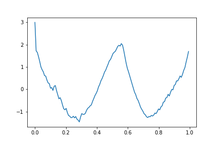
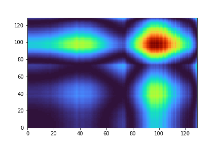
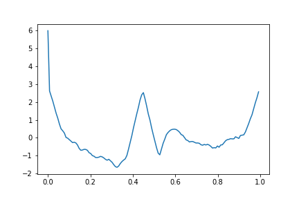
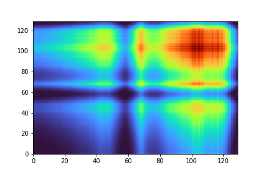

# Deep-FinGAF
[](https://github.com/iSab01/deep-FinGAF/actions/workflows/python-app.yml)
[](https://opensource.org/licenses/MIT)
## OnBoarding

### Transform tabular data to Gramian Angular Fields (GAF)
After making sure you installed all the required libraries,
you can run the following commands to transform tabular data to gaf :

#### First, import your raw data 
As the i-20 previous are used to create day's i GAF, you need to have more an interval more than 20 days long. 
In fact, you'll get interval_lenght-20 images saved.
````python
import yfinance as yf
your_stock = yf.Ticker("your_stock_ticker")
df = your_stock.history(start= start_date, end = end_date,interval= "1h")
````

To define the decision, a simple comparison is made in *trading_action*:
````python
def trading_action(future_close: float, current_close: float) -> str:
    if future_close < current_close:
        decision = 'LONG'
    else:
        decision = 'SHORT'
    return decision
````

Then you only need to run the following commands :
````python
from DataGeneration.raw_to_gafs_funcs import clean_non_trading_times, set_gaf_data, convert_to_gaf_and_save

your_stock = clean_non_trading_times(your_stock)
decision_map = set_gaf_data(your_stock)
convert_to_gaf_and_save(decision_map)
````

In your deep_FinGAF/data folder you shall get two directories, 
SHORT and LONG containing images containing each day information.

#### Train and test a model

Pretty easily done : 

````python
from model.models import CNN
from model.train import train, test_model

cnn = CNN()
train(cnn, 50)
test_model("../saved_model/cnn")

````
## More on GAF

Images are normalized to [-1,1] then converted to polar coordinates.
(*r.cos(phi) where phi = arcos(x)) and r is normalized time_stamp*)

With the polar vector, we build a Gramian Matrix. This matrix is then
processed into a heatmap and **that's your encoded image**.

Some examples :
Real plot             |  Encoded image
:-------------------------:|:-------------------------:
| 
| 
| 

## Ressources :   

*Zhiguang Wang and Tim Oates*: 
[Time-Series Image Encoding](https://www.ijcai.org/Proceedings/15/Papers/553.pdf)
